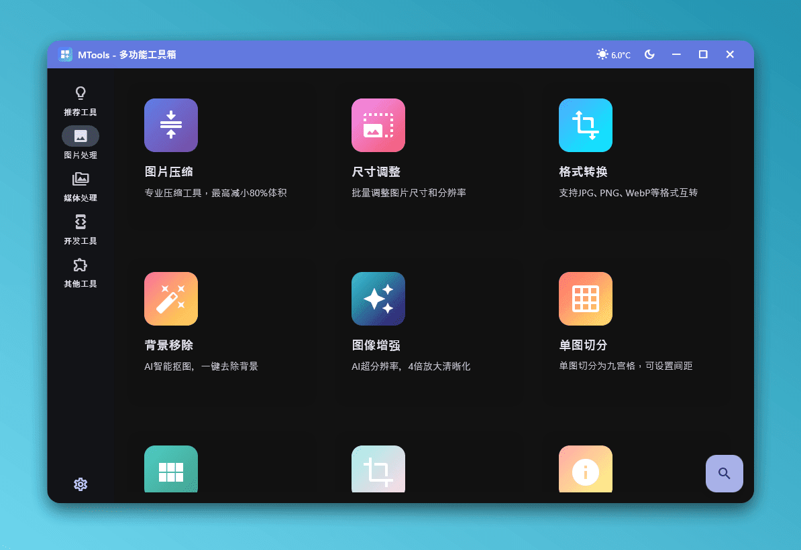
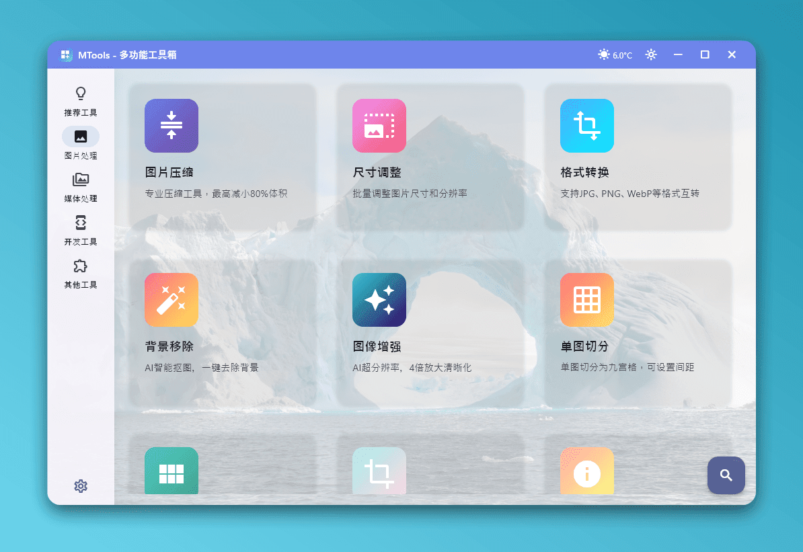
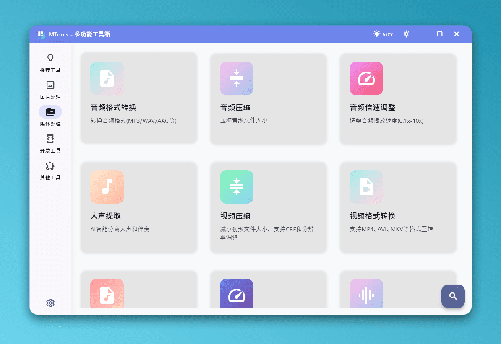
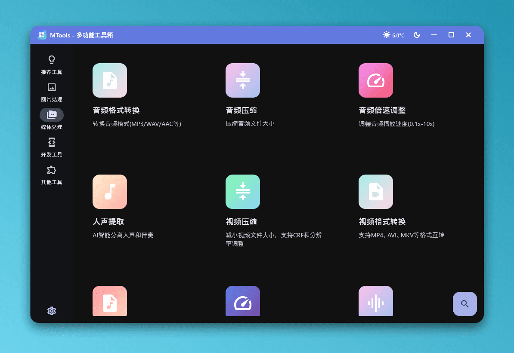
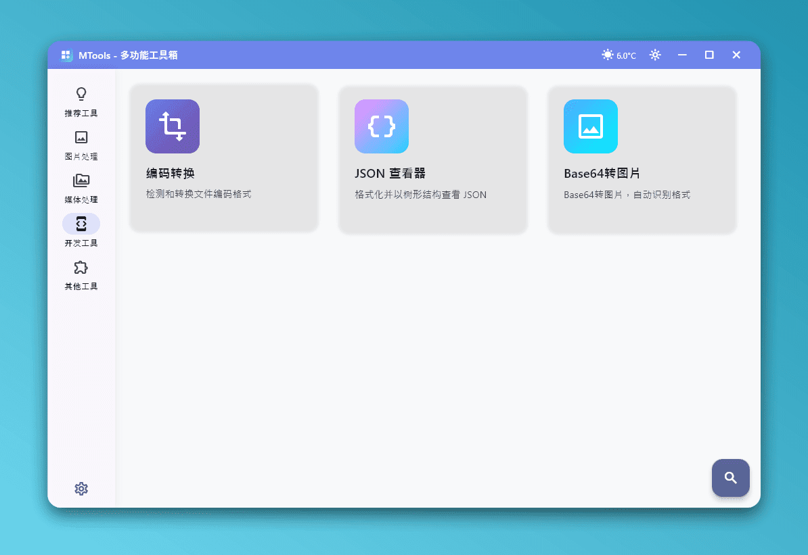
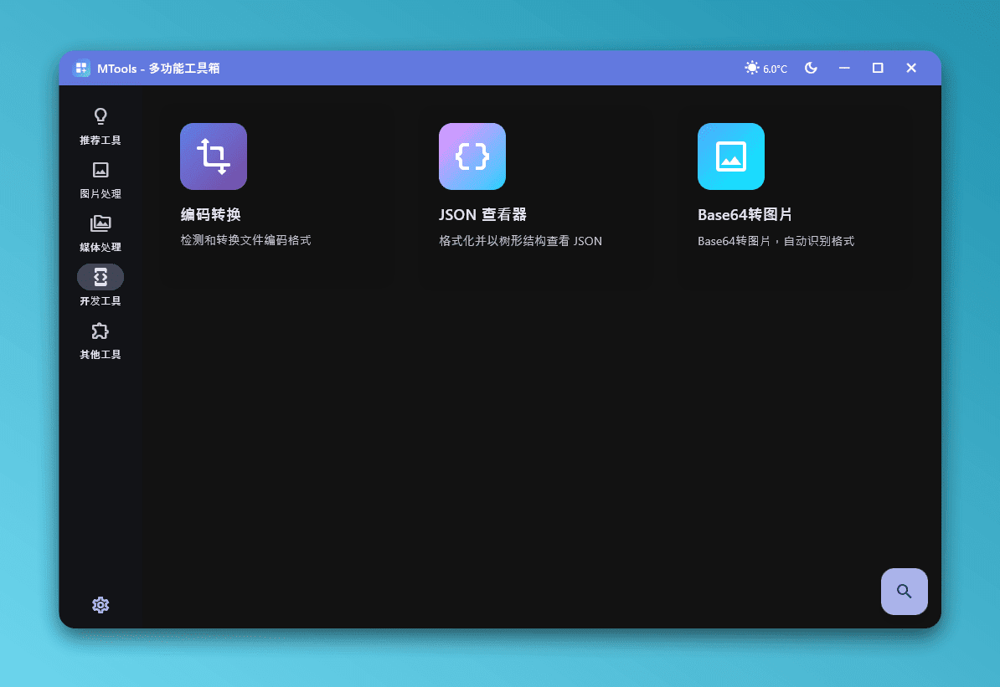
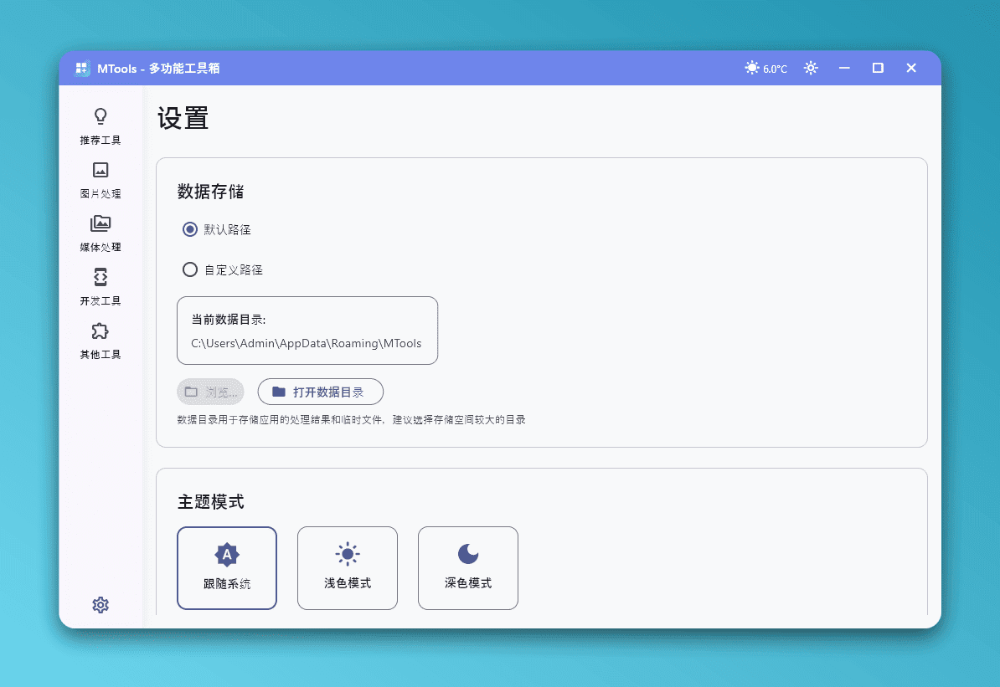
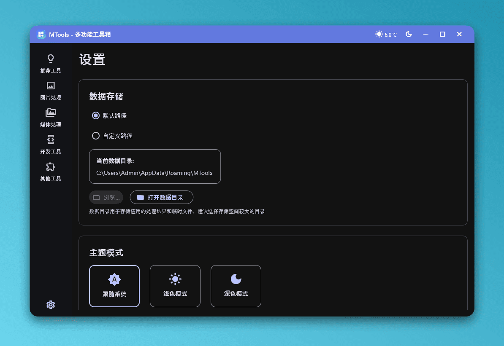
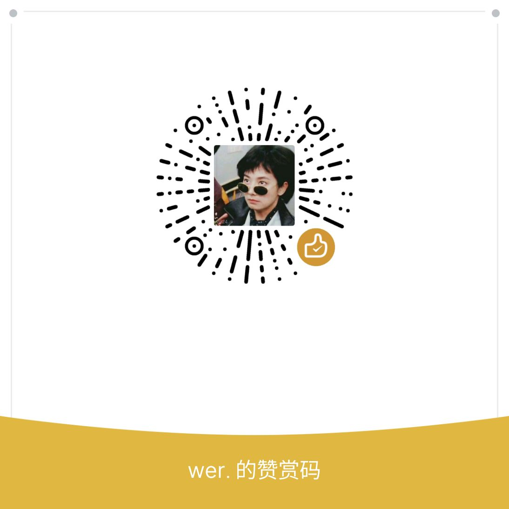

<div align="center">


# MTools
*一款功能强大、界面精美的现代化桌面工具集*

[](https://www.python.org/)
[](https://flet.dev/)
[](./LICENSE)
[]()


集成图片处理、音视频编辑、AI 智能工具、开发辅助等功能，支持跨平台GPU加速

[快速开始](#-快速开始) · [功能特性](#-核心特性) · [界面预览](#-界面预览) · [下载发布版](https://github.com/HG-ha/MTools/releases)

</div>

---

## 界面预览

### 多主题支持

<table>
  <tr>
    <td align="center"><b>浅色模式</b></td>
    <td align="center"><b>深色模式</b></td>
  </tr>
  <tr>
    <td></td>
    <td></td>
  </tr>
  <tr>
    <td colspan="2" align="center"><b>自定义背景模式</b></td>
  </tr>
  <tr>
    <td colspan="2" align="center"></td>
  </tr>
</table>

### 功能模块展示

<details>
<summary><b>图片处理工具</b> - 点击展开</summary>

<br/>

<table>
  <tr>
    <td align="center">浅色模式</td>
    <td align="center">深色模式</td>
  </tr>
  <tr>
    <td></td>
    <td></td>
  </tr>
</table>

**功能包括：**
- AI 智能抠图（背景移除）
- 专业压缩（mozjpeg + pngquant）
- 格式转换（12+ 种格式）
- 图片拼接（九宫格、横向、纵向）
- 尺寸调整、裁剪、旋转、水印
- 二维码生成、GIF 调整

</details>

<details>
<summary><b>音视频处理</b> - 点击展开</summary>

<br/>

<table>
  <tr>
    <td align="center">浅色模式</td>
    <td align="center">深色模式</td>
  </tr>
  <tr>
    <td></td>
    <td></td>
  </tr>
</table>

**功能包括：**
- AI 人声分离（UVR MDX-Net）
- 视频格式转换（MP4/AVI/MKV/MOV）
- 视频压缩（H.264/H.265）
- 音频格式转换（MP3/WAV/FLAC/AAC）
- 提取音轨、视频修复
- 速度调整、添加水印

</details>

<details>
<summary><b>开发工具</b> - 点击展开</summary>

<br/>

<table>
  <tr>
    <td align="center">浅色模式</td>
    <td align="center">深色模式</td>
  </tr>
  <tr>
    <td></td>
    <td></td>
  </tr>
</table>

**功能包括：**
- 编码转换（自动检测，解决乱码）
- Base64 转换（图片 ↔ Base64）
- JSON/XML/SQL 格式化
- 代码美化与验证

</details>

<details>
<summary><b>其他工具</b> - 点击展开</summary>

<br/>

**功能包括：**
- AI 证件照制作 - 智能生成各类规格证件照，支持多种尺寸和背景色
- Windows 更新助手 - 快速访问 Windows 更新设置
- 图片转 URL - 上传图片获取直链
- 文件转 URL - 上传文件获取分享链接
- ICP 备案查询 - 快速查询网站备案信息
- 更多实用工具持续添加中...

</details>

<details>
<summary><b>设置中心</b> - 点击展开</summary>

<br/>

<table>
  <tr>
    <td align="center">浅色模式</td>
    <td align="center">深色模式</td>
  </tr>
  <tr>
    <td></td>
    <td></td>
  </tr>
</table>

**设置选项：**
- 主题切换（浅色/深色/自动）
- 自定义主题色和字体
- GPU 加速配置
- 工具下载管理
- 性能优化选项

</details>

---

## 核心特性

### AI 智能处理

- **AI 智能抠图** - 一键移除图片背景，支持人像、动漫、通用场景等多种模型，GPU 加速提速 3-10 倍
- **AI 证件照制作** - 智能生成各类证件照，支持多种尺寸和背景，自动美颜和人脸矫正
- **AI 音视频人声分离** - 专业级人声/伴奏分离，支持 UVR MDX-Net 模型，轻松制作卡拉OK伴奏
- **AI 音视频转文字** - 直接处理视频或音频，从中提取字幕，支持输出字幕文件
- **AI 视频插帧** - 将低帧率视频进行补帧，提高视频流畅度
- **AI 图片、视频超分** - 支持对图片、视频进行修复和放大，例如720p修复到2k

### 图片工具箱

- **格式转换 & 压缩** - 支持 12+ 种格式，集成 mozjpeg、pngquant 专业引擎
- **智能编辑** - 尺寸调整、裁剪、旋转、水印、去除 EXIF
- **创意拼接** - 九宫格、单图切分、横向/纵向拼接
- **实用工具** - 二维码生成、GIF 调整、信息查看

### 音视频处理

- **格式转换** - 支持主流音视频格式互转（MP3/WAV/FLAC/MP4/AVI/MKV...）
- **智能压缩** - H.264/H.265 编码，自定义比特率和质量
- **速度调整** - 音视频加速/减速，不改变音调
- **提取 & 合成** - 提取音轨、添加水印、视频修复

### 开发辅助

- **编码转换** - 自动检测文件编码，一键解决乱码问题
- **Base64 工具** - 图片与 Base64 互转
- **代码格式化** - JSON/XML/SQL 美化与验证

### 更多工具请自行查看

---

## 快速开始

### 方式一：下载发布版（推荐）

直接下载已编译好的可执行文件，**无需安装 Python**：

- **[Releases 下载](https://github.com/HG-ha/MTools/releases)**
- **[国内用户下载](https://openlist.wer.plus/MTools)**

支持平台：
- ✅ Windows 10/11 (x64)
- ⚠️ macOS (实验性支持)
- ⚠️ Linux (实验性支持)

下载后解压即可使用！

### 方式二：从源码运行

#### 环境要求
- **操作系统**: Windows 10/11、macOS 或 Linux
- **Python**: 3.11+
- **包管理器**: [uv](https://github.com/astral-sh/uv) - 推荐使用的 Python 包管理器

#### 一键安装依赖

```bash
# 1. 克隆仓库
git clone https://github.com/HG-ha/MTools.git
cd MTools

# 2. 一键同步依赖（自动创建虚拟环境）
uv sync

# 3. 运行程序
uv run flet run
```

启用 CUDA GPU 加速（默认已启用平台通用加速）：

```bash
# 使用此方式可完全榨干NVIDIA GPU性能
# 替换为 GPU 版本（需要 NVIDIA GPU 和 CUDA 环境）
uv remove onnxruntime-directml onnxruntime
uv add onnxruntime-gpu==1.22.0
# 需要免去配置cuda和cudnn环境的话请更改为此依赖
# 会导致体积增大数倍
# uv add onnxruntime-gpu[cuda,cudnn]==1.22.0
```

> 📘 **版本说明**：
> - **普通版本**：支持NVIDIA、AMD、Intel显卡加速，支持coreml加速，对 NVIDIA GPU 的性能释放可能不如CUDA系列
> - **CUDA 版本**：使用系统安装的 CUDA 和 cuDNN，体积小但需要预先配置 CUDA 环境（CUDA 12.x + cuDNN 9.x）
> - **CUDA_FULL 版本**：内置完整的 CUDA 和 cuDNN 运行时库，无需额外配置，开箱即用，但体积较大（+2GB）

> 💡 **编译和版本说明**：如需将项目编译为独立可执行文件，请参考 📘 **[完整编译指南](./docs/build_guide.md)**

---

## 性能优化

### GPU 加速支持

本项目的 AI 功能支持 GPU 加速，可大幅提升处理速度，并且提供 `CUDA` 以及 `CUDA_FULL` 编译版本

### 平台特定说明

#### AI 功能（ONNX Runtime）

| 平台 | 默认版本 | GPU 支持 | 说明 |
|------|---------|---------|------|
| **Windows** | `onnxruntime-directml==1.22.0` | ✅ DirectML | 自动支持 Intel/AMD/NVIDIA GPU |
| **macOS (Apple Silicon)** | `onnxruntime==1.22.0` | ✅ CoreML | 内置硬件加速 |
| **macOS (Intel)** | `onnxruntime==1.22.0` | ⚠️ CPU | 无 GPU 加速 |
| **Linux** | `onnxruntime==1.22.0` | ⚠️ CPU | 可选 `onnxruntime-gpu` (CUDA) |

> 💡 **提示**：程序会自动检测并使用可用的 GPU，无需额外配置。

---

## 界面特色

- **Material Design 3** - 遵循最新设计规范，界面精美流畅
- **深色模式** - 自动跟随系统主题，保护视力
- **毛玻璃效果** - 现代化的视觉体验
- **自定义主题** - 支持多种主题颜色和字体选择
- **全局搜索** - `Ctrl+K` 快速查找任何功能
- **批量处理** - 所有功能均支持批量操作

---

## 致谢

### 代码参考

本项目在开发过程中参考和使用了以下开源项目的代码：

- **[sherpa-onnx](https://github.com/k2-fsa/sherpa-onnx)** - 语音识别与合成框架，提供高性能的离线语音处理能力
- **[PPOCR_v5](https://github.com/Nnow2024/PPOCR_v5)** - 高精度OCR识别引擎
- **[FunASR](https://github.com/modelscope/FunASR)** - 语音识别工具包
- **[ICP_Query](https://github.com/HG-ha/ICP_Query)** - ICP备案查询功能实现

感谢这些优秀的开源项目为本项目提供的技术支持和灵感！

### 外部服务

本项目使用了以下外部服务：

- **[ModelScope](https://www.modelscope.cn/)** - AI模型托管与分享平台
- **[imagetourl.net](https://imagetourl.net/)** - 图片转URL服务
- **[catbox.moe](https://catbox.moe/)** - 文件上传服务
- **[gh-proxy.com](https://gh-proxy.com/)** - GitHub加速代理

### 服务器赞助

感谢以下赞助商为本项目提供服务器支持：

- **[林枫云 www.dkdun.cn](https://www.dkdun.cn/)** - 提供稳定的云服务器资源

---

<div align="center">

## Star History

[](https://star-history.com/#HG-ha/MTools&Date)

---

## 支持项目

如果这个项目对你有帮助，欢迎通过以下方式支持：

- 给项目一个 ⭐ Star
- 分享给更多需要的人
- 提交 Issue 和 Pull Request
- 请作者喝杯咖啡 ☕

<details>
<summary>打赏支持</summary>

<br/>

你的支持是项目持续维护的动力！

<div align="center">
  
  <p><b>微信赞赏</b></p>
</div>

</details>

---

**Made with ❤️ using Python & Flet**

👨‍💻 **作者**：[HG-ha](https://github.com/HG-ha)

[GitHub](https://github.com/HG-ha) · [更多项目](https://github.com/HG-ha?tab=repositories) · [加入Q群 1029212047](https://qm.qq.com/q/gHf7f0R3zy)

**如果这个项目对你有帮助，请给个 ⭐ Star 支持一下！**

</div>
